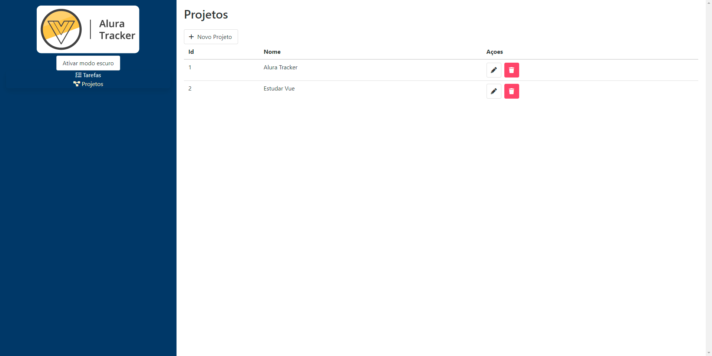
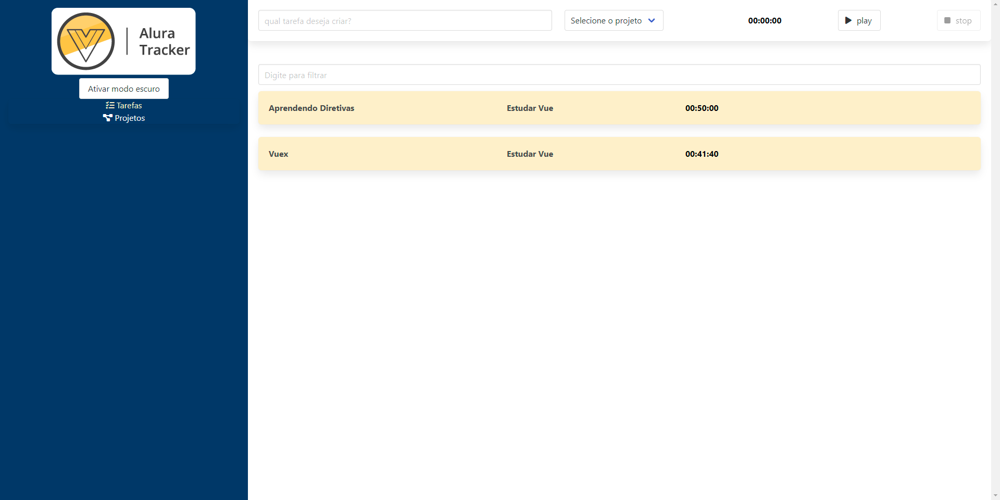

<h1 style="text-align: center; font-weight: bold;">Alura Tracker</h1>

## Preview 📸
<div align="center" style="width: fit-content; display:flex; justify-content: space-between; margin:0 auto;" >
  
  
</div>

## Sobre o Projeto
Aplicação desenvolvida durante a Formação Vue.js da [Alura](https://cursos.alura.com.br/formacao-vuejs3).
A atividade consiste em duas telas, sendo uma onde podemos registrar, cronometrar, pesquisar e editar tarefas e outra para configurações do projeto.

Dentro do ambiente Vue exploramos a base para criações de componentes, gerência de estado, rotas, requisições, mixins, hooks e estilização com css.


### 🛠 Tecnologias
As seguintes ferramentas foram usadas na construção do projeto:

- [Vue](https://vuejs.org/)
- [JSON Server](https://www.npmjs.com/package/json-server)

### Pré-requisitos
Antes de começar, você terá que ter em sua máquina o [Node.js](https://nodejs.org/en/) e o [JSON Server](https://www.npmjs.com/package/json-server) terá que ser inicializado junto ao projeto, basta inserir no console:
```bash
$ json-server --watch db.json --port 3000
```
caso utilize uma porta diferente a mesma deve ser setada na baseURL em ./src/htttp/index.ts

### 🎲 Rodando o projeto

```bash
# Instale as dependências
$ yarn install
# ou
$ npm install

# Execute a aplicação
$ yarn serve
# ou
$ npm run serve
```